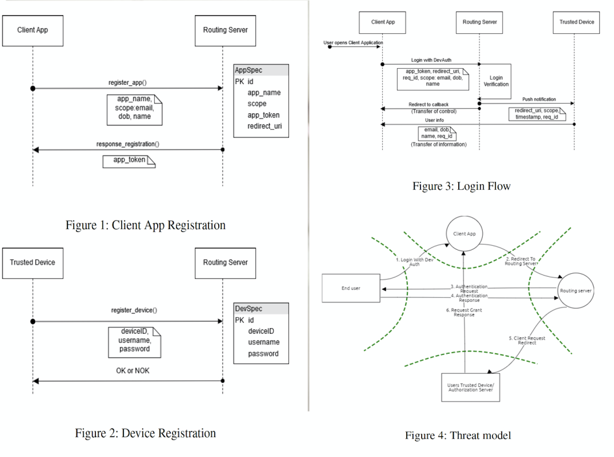
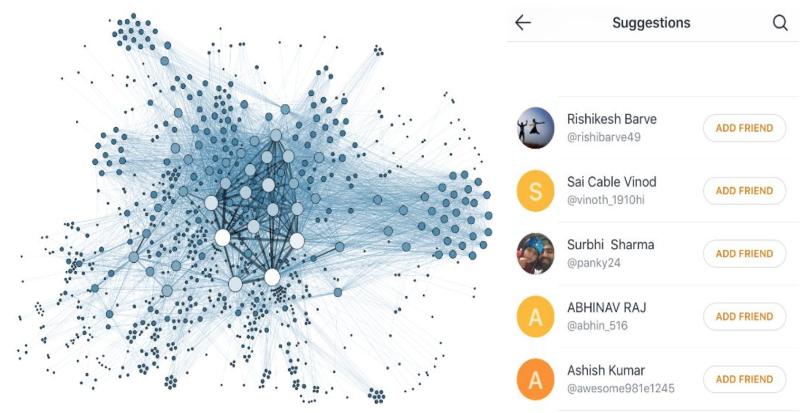
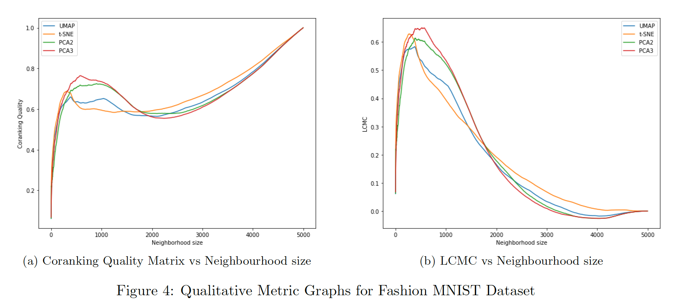
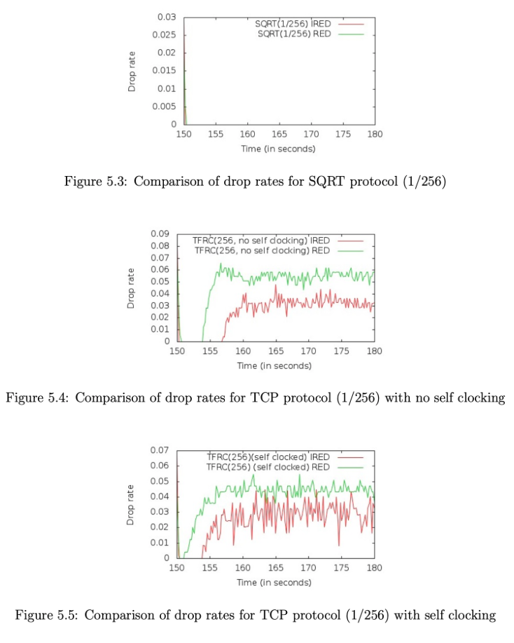
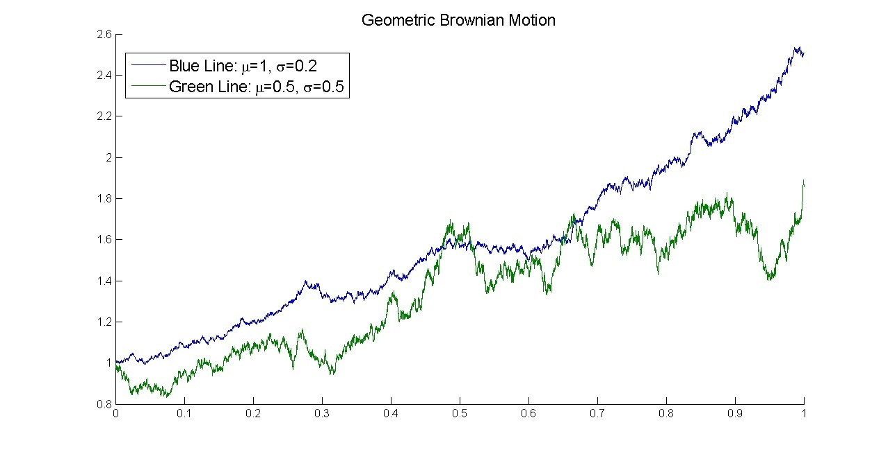

## Welcome to my little corner in the Digital World!

My primary interest is in Cybersecurity, Data Science and Distributed Systems. Here's the finest collection of the projects I have worked on. 

[Here is my resume](/CV-Prateek Narendra.pdf)

You can find me on : 

    &nbsp;&nbsp;          

### DevAuth - Device Based Federated Login

Federated login using protocols like OpenID Connect is convenient as it solves the problem of password reuse by allowing the use of the same account across different websites, but that creates another issue. The main problem in this infrastructure is reliance on these third-party identity providers to relay information to client applications. We seek to address the problem of our reliance on corporate ownership of sensitive user information. In this project,we developed a Proof of Concept to demonstrate a device based federated login mechanism that selectively allows client applications access to user information without them going through third parties. We design a flow for DevAuth that resembles the RFC-6819 implicit flow, and assess the security implications of such a protocol. We show that although future work needs to be done to holistically assess the protocol, it is a viable alternative to current federated login techniques.

[Link to Repo](https://github.com/pnpninja/DevAuth)

### Semantic Approach for Classifying Twitter Users

Social Media has grown rapidly in the past several years. Twitter in particular has seen a significant rise in its user audience because of the short and compact Tweet concept (140 characters). As more users come on board, it provides a large market for companies to advertise and and prospective customers by classifying users into different market categories. Traditional classification methods use TF-IDF and bag of words concept as the feature vector which inevitably is of large dimensions. In this project, we propose a method to improve the method of classification by using semantic information to reduce dimensions of the feature vectors and validate this method by feeding them into multiple learning algorithms and evaluating the results.

[Link to Paper](https://link.springer.com/chapter/10.1007/978-981-10-3376-6_3)

### Evaluating Dimensionality Reduction Methods

 

With the explosion of data in many different areas of science, the number of features in
the datasets have exploded. While these additional features are helpful in helping refine our
machine learning models, it comes at the added cost of processing time. Some of the datasets
now have more features than observations. Humans are unable to visualize or imagine in more
than 3 dimensions. Visualizations can help us in evaluating if we are analyzing the information
correctly and proceeding in the right direction. To resolve both these problems, researchers came
up with novel methods which help in reducing dimensions of the dataset while minimizing loss
of clustering information of our dataset. Dimensionality Reduction is a concept in Data Science
and Machine Learning, which is the process of reducing the number of random variables under
consideration by obtaining a set of principal variables which makes it an important operation
for large datasets. 

We developed a set of qualitative and quantitative metrics to select the most appropriate dimensionality reduction algorithm. These metrics were calculated across multiple datasets of different categories and evaluated by comparing the accuracy of Machine Learning models before and after applying each dimensionality reduction algorithm

[Link to Report](https://drive.google.com/file/d/1CWk-Kve_c6iG3tvDfV2wH8iRDMn8AD0h/view?usp=sharing)

### Improvement over RED-based Protocol for Congestion Control in Sensor Clouds

Wireless Sensor Networks (WSNs) and Cloud computing are two emerging technologies, respectively, in the networking and computing fields. Sensor Cloud integrates WSNs and Clouds into an extended form of cloud infrastructure that manages sensors scattered throughout WSNs. Networking plays a crucial role in Cloud computing and becomes a particularly challenging issue in sensor Clouds due to resource limitation of WSNs as the underlying network of the Cloud infrastructure. Therefore, data transmission from sensors to servers in sensor Clouds must be carefully controlled to avoid network congestion. We have studied Random Early Detection-Based (RED-based) congestion control for data transmission in sensor Clouds. Then we propose an improved RED algorithm that meets sensor Cloud networking requirements better and develop a queueing model coupled with analysis technique to evaluate the performance of the proposed conges- tion control scheme. We conduct basic simulations to evaluate performance of Improved RED compared with the regular RED algorithm. Our analysis and simulation results demonstrate that the proposed congestion control achieves better drop rate performance in comparison with the standard RED for data transmission in sensor Clouds. The easily implemented control mechanism and low complexity of our proposed algorithm make it more suitable for sensor Clouds.

[Link to Report](https://github.com/pnpninja/NetworkProjectReport/raw/master/NetworkProject.pdf)

### Stock Price Modeling using Brownian Movement 

 

In this project, we model the movement of the stock price of a company using factors like - Initial Stock Price ,Yearly Drift, Yearly Volatility. We leverage OpenMP to distribute the calculation among multiple cores and also compare the speedup against single core processing.

[Link to Repo](https://github.com/pnpninja/ParallelComputing)

### Quote for the Day (DuckDuckGo feature)

Contributed a feature to Duckduckgo that displays the quote for the day from TheySaidSo API 

[Check it in action](https://duckduckgo.com/?q=quote+for+the+day&t=h_&ia=answer)

### NSE Tools - Maven Package

Developed and released a Maven Package that scrapes the stock price from Indian National Stock Exchange. This helps other developers who want to get the historical quotes for their projects who do not want to pay for premium services.
 
[Link to Maven Package](https://mvnrepository.com/artifact/com.github.pnpninja/nsetools/1.0.0)

### JVM Sandbox

Developed a Sandbox to test whether a Java Program is malicious or not. We can verify that the program does not have infinite loops ,does not breach memory limits and does not have very big instruction blocks. 

[Link to Repo](https://github.com/pnpninja/jvmsandbox)

