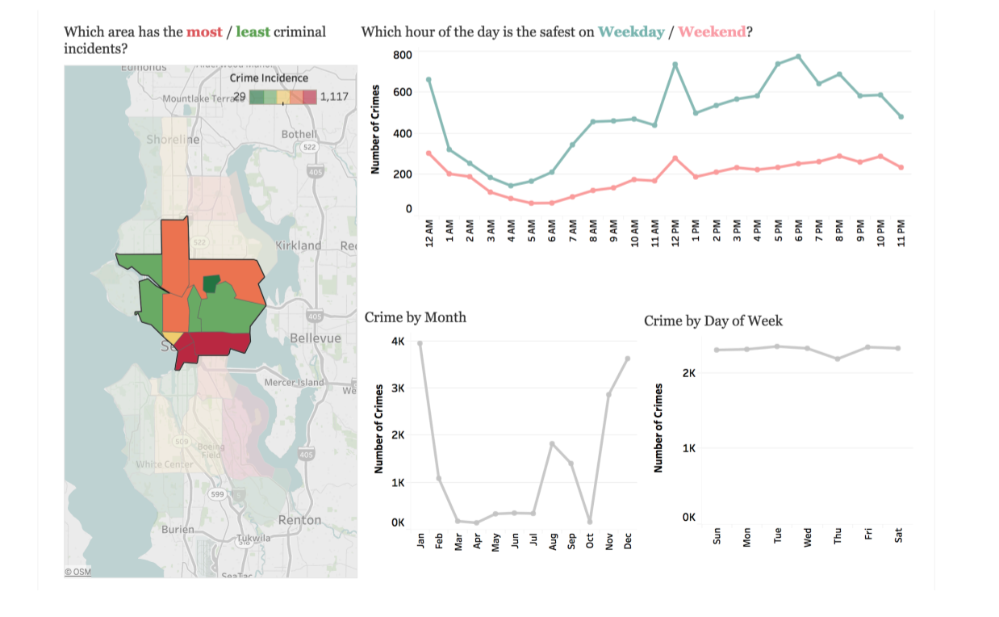
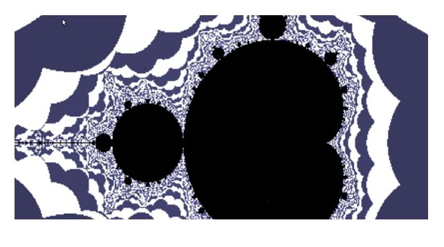
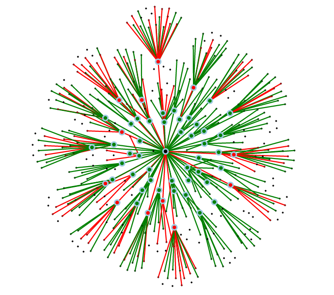
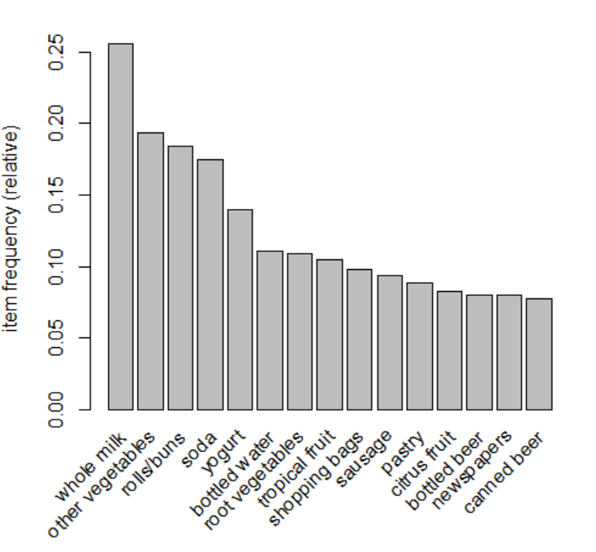
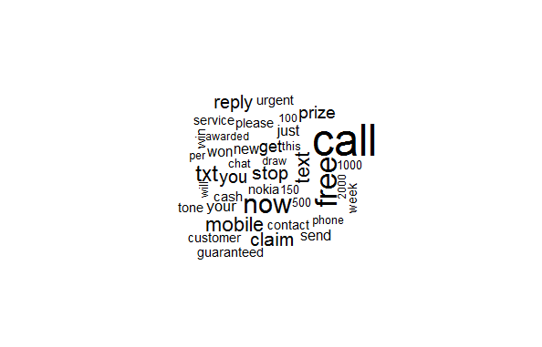
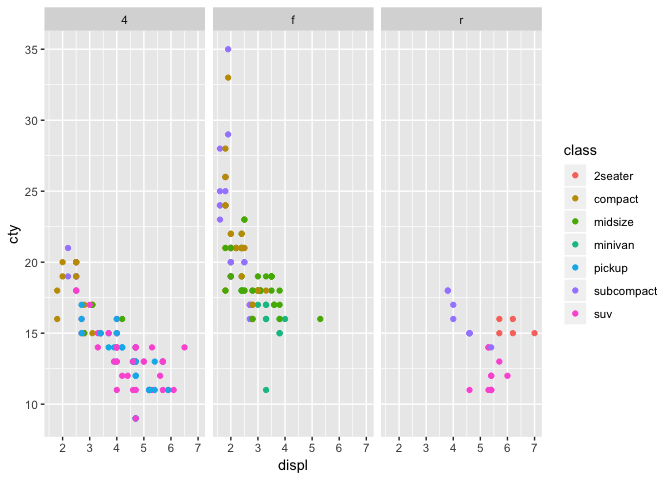

## Welcome to my space!

Here I present to you an assortment of some pet projects on Data Science and some academic projects on Computer Networks and Parallel Computing. Happy Browsing! :D

Also find me here:

    &nbsp;&nbsp;          

### Where-to-next - A Google Local Recommendation System

In recent years, the use of systems that can make personalized recommendations using user data and purchase/visit history has increased significantly. Everyday millions of searches are made on Google, with a bulk of the searches attributed to look for reviews before visiting a particular place. User preference, Item popularity and User stringency while giving ratings vary over time, which adds to the complication of suggesting places. Traditional recommendation systems use collaborative and content-based methods, but do not incorporate time information. Hence, I have used variants of collaborative filtering methods to capture the temporal effects while making recommendations. This enables the system to make personalized recommendations.

The following different types of the recommendation models were implemented:

1. Neighbourhood Model (User-User collaborative filtering)
2. Latent-Factor Model
3. Content-Based Model

[Link to Repo](https://github.com/madhasri/where-to-next)

### Seattle Crime Visualization

Created an informational visualization to help the general public identify the high crime zones filtered by area, time, month and day of the week. Additionally, a secondary page in this visualization allows the user to compare two neighbourhoods of Seattle and show a much more granular vision of the crime incidence.

[Link to Visualization](https://public.tableau.com/profile/madhavi.srinivasan#!/vizhome/HowsafeisourSeattle_0/CrimeinSeattle-Anoverview?publish=yes)

### MandelBrot Set Generation

 

This is a parallel computing project that analyzes and compares the peformance of static and dynamic MPI to generate the Mandelbrot set.

[Link to Repo](https://github.com/madhasri/Mandelbrot-Parallel-Computing)

### Political Bias Estimation

Most of the News and Media organizations in the world have some direct or indirect political affiliations, hence the content generated by these organizations is biased towards the respective ideologies of the political parties that the news organization is affiliated with.We aim to find the political leanings of few of the leading newspapers in India. This holds relevance as India is the world’s largest democracy with more than 1700 political parties and also the largest market for newspapers in the world with over 100 million copies sold every day. A framework has been proposed integrating a Social graph approach and Natural Language Processing (Machine Learning) approach to identify and estimate bias in the Indian context. Further a case study has been performed analyzing Twitter Data of Indian News Organizations.

[Link to Repo](https://github.com/madhasri/Political-Bias-Estimation)

### Twitter Trending Topic Classification

In the era of Social Networking, tweeting is the newest trend. About 200 million tweets are being generated every day. Twitter provides a list of the most trending topics; it is often hard to understand what these topics are about. This project is to classify a set of tweets T1,T2,T3,...,Tn into general categories like Sports, Business, Entertainment, Technology, Food and Lifestyle and others. Each tweet can belong to more than one category.

[Link to Repo](https://github.com/madhasri/Twitter-Trending-Topic-Classification)

### Market Basket Analysis

Market basket analysis on 9835 transactions collected from a supermarket for a 30 day time frame.

More about Market Basket Analysis [here](https://towardsdatascience.com/a-gentle-introduction-on-market-basket-analysis-association-rules-fa4b986a40ce)

[Link to Repo](https://github.com/madhasri/Market-Basket-Analysis)

### SMS Text Analysis

This repo contains R code to carry out text processing on data. This includes removal of stopwords, tokenization and document-term matrix. A wordcloud visualization is created to get an overview of keywords used in spam and ham messages.

[Link to Repo](https://github.com/madhasri/SMS-Text-Analysis)

### Data art using ggplot

This repo is a tutorial experimenting with different options available in ggplot.

[Link to Repo](https://github.com/madhasri/data-viz-ggplot)

### LDA Web App

A web application created using Django framework that expects a document as input and runs LDA ( Latent Dirichlet Allocation) to discover different topics from it.

More about LDA [here](https://towardsdatascience.com/topic-modeling-and-latent-dirichlet-allocation-in-python-9bf156893c24)

[Link to Repo](https://github.com/madhasri/LDA-Web-App)

### Mini TCP/IP Stack

Implemented a mini TCP/IP stack using socket programming.

[Link to Repo](https://github.com/madhasri/Mini-TCP-IP-Stack)

